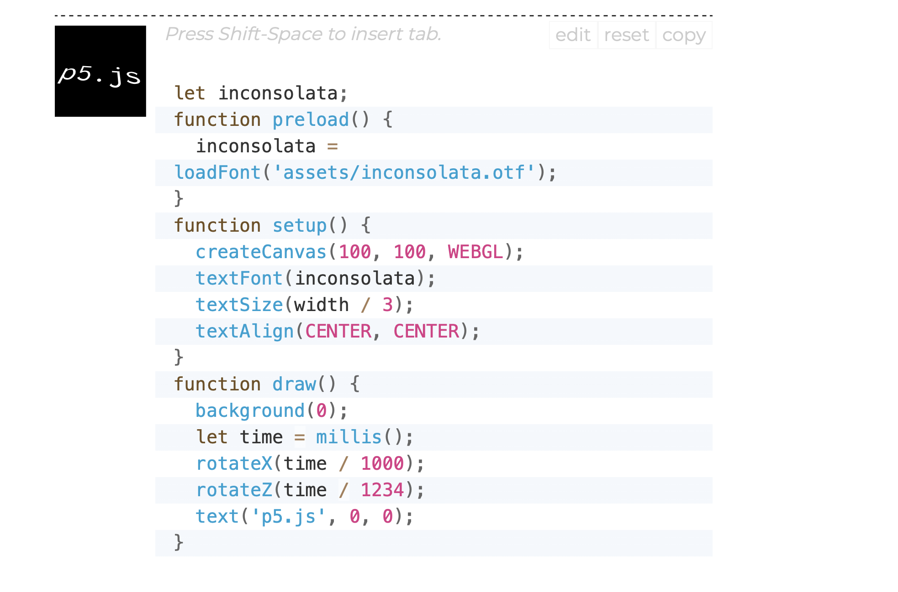

# Thinking
A clock of 3 time dimensions...  
I want to do a changing number visual for the hour, ... wait, How about 

# Hour
I started with hour because I thought it would be the easist.  
My logic:  
1. Name an initial number
2. write a if: if the number is not the initial number, make the initial number the hour now, and add the length of the rect
I fixed the problem I encountered by moving the factor (hourSize) from outside the draw() to inside so it won't be refreshed every frame.   

Problem: the rectangle is not in the center.  
I fixed it by naming the x and y positions to their relations of the 2/screen.   

# Clock Text
Then, I feel like visuals are good, but a digital clock would be a great hint.   
I want to explore text() to do this.  

When I was checking the reference, I thought this might be helpful in creating fun gifs visuals in the future so I took a note here:  

I began by confirming where to put the text in case the display text might go bug later. 
I looked up how to write ":" in code and it's **+ ':' +**

# Minutes
Using the same for loop, I drew the circle that changes size according to the minute change. 

# Seconds
I made the frame rate 1 and use second to decide random RGBs.  

# Ajustments
I adjusted the color & make the rect to the front given the minute circle will always cover the rect during midnight. 